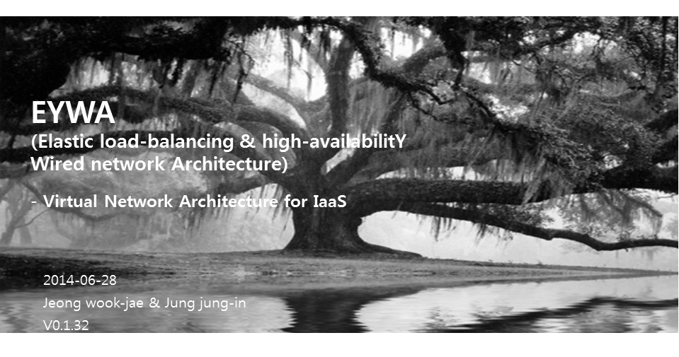
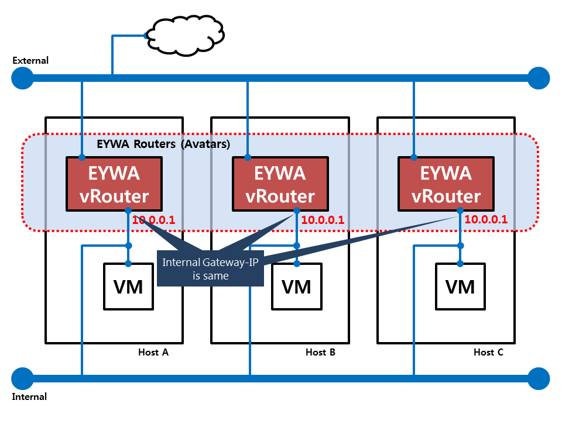
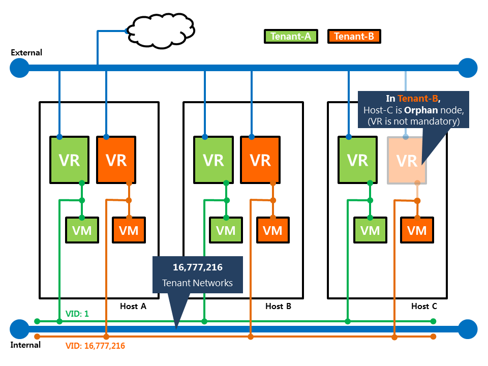
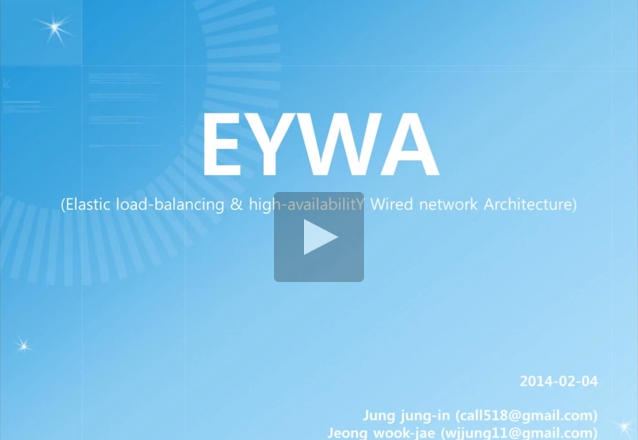
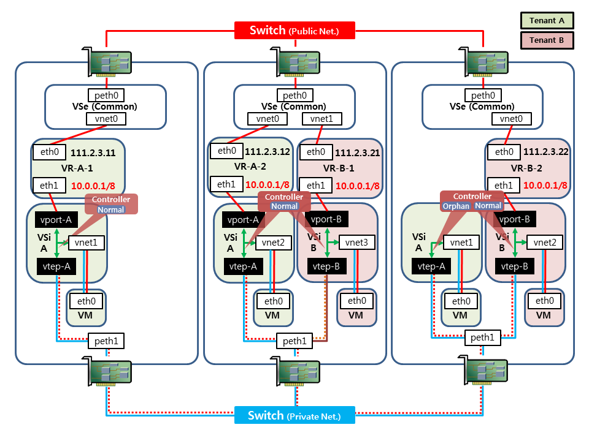
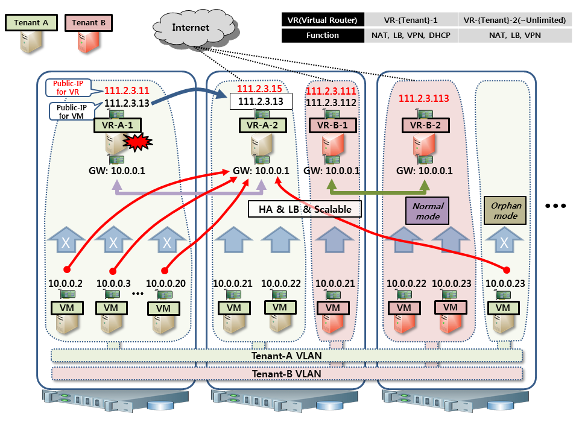

# EYWA

## Description

* **EYWA** is "**E**lastic load-balancing & high-availablit**Y** **W**ired network **A**rchitecture".
* Next-generation data center network architecture for IaaS.

### About EYWA (SlideShare)

<a href="http://www.slideshare.net/WookJaeJeong/eywa-45939266" alt="Click to watch the Video of PoC" target="_blank">
  
</a>

## Development

To contribute bug patches or new features, you can use the github Pull Request model. It is assumed that code and documentation are contributed under the Apache License 2.0.

More info:

More info:
* [How to Contribute](http://opennebula.org/software:add-ons#how_to_contribute_to_an_existing_add-on)
* Support: [OpenNebula user mailing list](http://opennebula.org/community:mailinglists)
* Development: [OpenNebula developers mailing list](http://opennebula.org/community:mailinglists)
* Issues Tracking: Github issues (https://github.com/OpenNebula/addon-eywa/issues)

## Authors

* Leader
 * Jung jung-in (call518@gmail.com)
 * Jeong wook-jae (wjjung11@gmail.com) 

## Compatibility

* Optimization and compatibility was confirmed in OpenNebula 4.6 and 4.10.
* Support Hypervisor: Currently only supports kvm.
 * (Recommended) "default" datastore's QCOW2 TM_MAD.
* OpenNebula for the PoC was installed based on the document link in the following content.
 * http://docs.opennebula.org/4.10/design_and_installation/quick_starts/
* (Tested on Ubuntu14.04amd64 and CentOS7.x, we expect no problems in other platform.)
* Add-on nature, Network highly dependent on environmental factors, there is a need for sufficient review of this Limitations and Requirements information.

### SandBox: Two ways

+ With Fully-Automated Vagrant SandBox (Recommended)
 * Support Multiple Hosts: 3 nodes (1master/slave & 2slaves-only)
 * "install.sh" script does not have to be executed. (This addon-eywa is pre-installed/configured)
 * We were prepared so that you can try the simulated fully-automated SandBox experience EYWA, /w Vagrant.
 * SandBox and consists of Vagrant and the Puppet, can be downloaded from the following Repository to test it.
 * <a href="https://github.com/call518/EYWA-on-Vagrant" alt="Open the Repository of EYWA Vagrant SandBox" target="_blank">EYWA Vagrant SandBox</a>

## Features

### The Benefits of EYWA

1. Performance
 * Load Balancing by Multiple VR (No Limit)
2. High Availability
 * HA by Multiple VR (No Limit)
3. Traffic Engineering
 * Save of Network Bandwidth
 * Traffic Isolation by VxLAN (16,777,216)
 * Multicast instead of Broadcast
 * Decrease in Packet Floods
 * Flat Address
 * Multiple Gateway for Load-balancer of Inbound & Outbound Traffic
4. Cost
 * Multiple VR instead of L4 Switch (Single Router)
 * Scalable VR

#### in Public Network

1. Load Balancing
 * Load Balancing by Unlimited VRs(Virtual Router)
 * Scale-out
 * Load balanced Inbound & Outbound Traffic
2. High Availability
 * HA by Unlimited VRs
3. Traffic Engineering
 * Save of Network Bandwidth
 * Low latency
4. VM Migration

#### in Private Network

1. A large number of tenants
 * A large number of VLANs
 * Traffic Isolation by VxLAN (16,777,216)
2. Large layer 2 network
 * 10.0.0.0/8 (16,777,216 IPs) per Tenant
 * Multicast instead of Broadcast, by VxLAN
 * Decrease in MAC Flooding, by VxLAN
 * Eliminate Broadcast (ToDo)

### Transparent and scalable Virtual Router (Avatars)



### Isolation & Traffic Engineering



## Installation

Before you install, it requires some input environment information.

After you decide matters before the environmental information, we hope to start the installation.

### Environment Information required

* IP address of the Front-End equipment. (for management, for Access "eywa" DB)
* The root account passwords of the physical host.
* MySQL root password.
* The root account password for the VM to be created in EYWA Private Network.
* The root account SSH public-key file for the VM to be created in EYWA Private Network.
* The name of the Public-Network produced in OpenNebula.
* Internal NIC to be used for VxLAN tunnel.

#### (Sample)

```
[Your Input Values....]
 * Front-End Node's IP: 172.21.20.11
 * Physical Host's root password: 123456789
 * MySQL root password: 123456789
 * EYWA VM's root password: 123456789
 * EYWA VM's SSH Public Key File: /var/lib/one/.ssh/id_rsa.pub
 * EYWA Public Network Name: Public-Net
 * Private NIC for VxLAN: eth0
```

### Run install.sh

Most EYWA installation process is to place the files necessary to perform EYWA operational mechanisms to OpenNebula.

* It is run on the OpenNebula Front-End host.
* Run as root privileges.
* All of the physical host must be able SSH Password login as root with each other.
 * (Note) "install.sh" script need an SSH connection to Cluster hostss from the Front-End host.

```
# ./install.sh
```

## Configuration

* You must correctly enter "environmental information".
* EYWA is dependent on the mechanism of the Hook and Contextualization of OpenNebula.

### Hook Scripts

```
# ls -al /var/lib/one/remotes/hooks/eywa
fail_eywa_vr.sh
set_eywa_net.sh
set_eywa_user.sh
set_eywa_vnet.sh
unset_eywa_net.sh
unset_eywa_user.sh
```

### Contextualization Scripts

```
# tree /var/lib/one/files/
/var/lib/one/files/
├── eywa-vm
│   └── init.sh
└── eywa-vr
    ├── haproxy-cfg-gen
    ├── haproxy.cfg.tmpl
    ├── haproxy.init
    ├── init.sh
    └── iptables.rules
``` 

### Modify OpenNebula VM_MAD of KVM

Add custom script for EYWA, "/var/lib/one/remotes/vmm/check_eywa_net.sh".

edit file, "/var/lib/one/remotes/vmm/kvm/deploy".

(The bottom line was added., before creating VM by virsh. because of VM_HOOK's ASYNC.)

```
source $(dirname $0)/../check_eywa_net.sh
```

#### Additional Description

OpenNebula's HOOK is ASYNC, so EYWA's network hook script(set_eywa_net.sh) works by stochastic. The reason is, The BOOT step is dependent on the script of PROLOG(set_eywa_net.sh) step. Further, there is a need for improvement.

## Usage

(Note) When you create a user in OpenNebula, the Tenant Network are created and prepared by Hook.

 * Template for the VM to be driven in the Tenant Network
 * Template for VR(Virtual-Router) that is responsible for the gateway role between Tenant-Network and External-Network.

### Default Templates

* **{UID}-EYWA-Router**
 * Role: EYWA Virtual Router Appliance for HA/LB.
 * Tow NICs: eth0(External), eth1(Internal:10.0.0.1/8)
 * Placement Strategy: One-VM per Physical-Host per Tenant. (If duplicated, it will delete..)
* **{UID}-Ubuntu(EYWA)**
 * Role: EYWA VM for Tenant's Application Instance.
 * One NICs: eth0(Internal:10.0.0.0/8)
 * Placement Strategy: N/A (by OpenNebula)

### Test Scenario of EYWA

1. Log in to Web-UI, by "oneadmin" user.
2. Go to "System" Tab -> "Users" Tab.
3. Click "+" Button.
4. Create "testuser" User. (username and password is that you want.)
 * Then, Default Templates is generated. (in "Templates" Tab)
5. EYWA-Virutal-Router(VR-1) is automatic launched. (in "Virtual Machines" Tab)
6. When VR-1 is up, Create EYWA-VM(VM-1).
7. Add VR-2 for LB/HA
8. Add VM-2.
9. Test Ping, to/on all Nodes.

## Requirements

1. Your network environment due to VxLAN, this Jumbo-Frame Support on the physical network or, MTU should be 1450 of the VM.
 * Default: The MTU is set to 1450 in the VM CONTEXT script.
2. Disk Image is used as the VR / VM (qcow2, Ubuntu_trusty_64) has been provided separately due to some pre-setup/pre-install.
 * To eliminate the limitations of using VR Image, considering the functions transferred to the CONTEXT script.
 * There are also ways to register OpenNebula Marketplace.
3. EYWA manages the meta-information to the MySQL Database.
4. We recommend separation of the external NIC and internal NIC. However, it is a single NIC is available.
 * e.g) External: eth0, Internal: eth1
5. Current automated installation script (install.sh) is supported Ubuntu14.04 and CentOS7 distribution. (Ubuntu14.04 is Recommended)
6. We tested based on the KVM Hypervisor. We expect no restrictions in other Hypervisor.

## Limitations

* Not yet support Migration fo EYWA-VR/VM, and deployment strategy of EYWA-VR.

## Other

### Traffic Flow of EYWA

<a href="https://prezi.com/ev6udwtvysnr/eywa-elastic-load-balancing-high-availability-wired-virtual-network-architecture/" alt="Click to watch Traffic Flow of EYWA" target="_blank">
  
</a>

### PoC - Demo Video

<a href="https://www.youtube.com/watch?v=FsXDuiWqmJk" alt="Click to watch the Video of PoC" target="_blank">
  
</a>

### Architecture of EYWA

### ToDo

* VR scheduling design for location/re-location/scaling
* We are considering changing to a stop by Hook-script Custom-Network-Driver.
* For efficient Traffic Engineering, it shall be additional features, such as Arp-Proxy and Caching ARP.
* Metadata DB optimization of EYWA.
* Supporting VM/VR Migration.
* Although the state sets of RESTRICTED_ATTR this is all commented out in oned.conf, it is necessary to allow only the necessary policy adjustments.
* Independent on VM_HOOK's ASYNC
* Providing the VR in Docker Container or Network Namespace.



### EYWA Scenario Sample


